# Veil — Project Report

**CASA0018: Deep Learning for Sensor Networks · 2025/26**

*A Privacy-First Multi-User Avatar System Driven by On-Device 1-D CNN Action Recognition over 52-d ARKit Blendshapes*

| | |
|---|---|
| **Author** | Yidan Gao |
| **Build tag** | `v4.3-localfix` |
| **GitHub** | https://github.com/<user>/Veil |
| **Live demo** | https://<user>.github.io/Veil/mobile_avatar.html?local=1 |
| **3-min video** | <youtube/vimeo url> |

---

## 1. Introduction

Veil is a privacy-first, browser-only multi-user avatar system. It replaces the camera frame in a video call with an on-device 3-D avatar driven entirely by a locally-inferred face-expression vector — no pixel, no audio, and no recognisable face data ever leaves the device. The pipeline runs end-to-end inside a single HTML page: MediaPipe Face Landmarker compresses each 640 × 480 frame into 52 ARKit-compatible blendshape coefficients, a 32 K-parameter 1-D convolutional network classifies a 30-frame sliding window into one of eight discrete facial actions, and a 233-byte binary packet at 24 Hz drives a Three.js + VRM avatar in every other peer's browser. This report documents the problem context (§2), users (§3), data and processing (§4), model and architecture (§5), deployment results (§6), critical reflection (§7), and future work (§8).

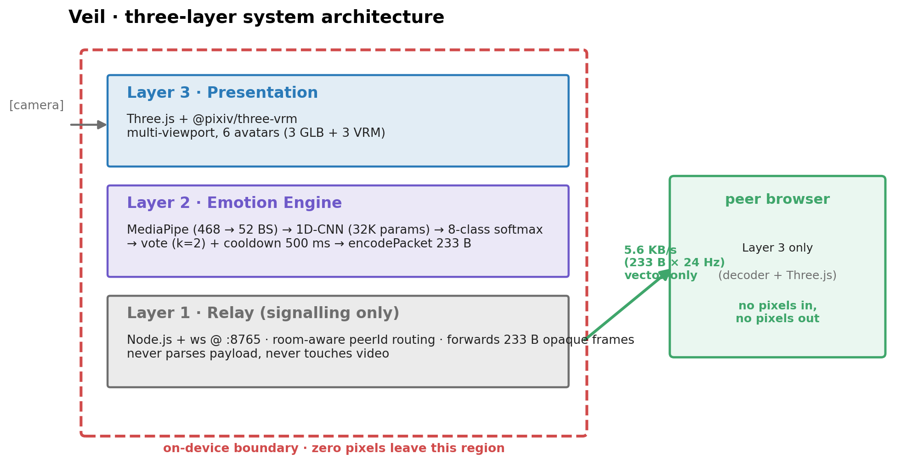

*Figure 1 — Three-layer system architecture: an on-device boundary (red dashed) wraps MediaPipe and the 1-D CNN; only opaque 233-byte vectors cross the network to the relay and remote peers.*

## 2. Problem Context and Research Question

Video calling is now infrastructure for work, family, and study, but every user makes an uncomfortable trade each time they switch on the camera: they expose their room, body, and face in exchange for the ~ 55 % of meaning that voice and text cannot carry (Mehrabian, 1971). Bailenson (2021) names the resulting state *non-verbal overload* — the fatigue of constant close-up self-view, the inability to look away, and the spatial constraint of the screen rectangle. The trade is sharpest in shared housing, hospital wards, counselling, and low-bandwidth networks; in a 2023 IPSOS survey 64 % of remote workers admitted to disabling the camera purely to hide their environment.

Cloud-based "private visualisation" services (Apple Vision Pro Persona, ZEGO) confirm market demand but still require frames to leave the device, transferring the trust problem onto the provider. Recent advances in TinyML (Warden and Situnayake, 2019) and browser-side ML (Lugaresi *et al.*, 2019) now make it feasible to extract 52-dimensional semantic features in ≤ 25 ms entirely on-device — the engineering window in which Veil sits.

The central research question is therefore: **can a fully browser-resident 1-D CNN, fed only with sequences of 52-dimensional ARKit-style blendshape vectors, recognise eight discrete facial actions in real time and drive remote-avatar mood synchronisation through a sub-6 KB/s semantic channel — with no pixel, audio, or recognisable face data ever leaving the device?** The question decomposes into three sub-questions: *(a) model* — can a 32 K-parameter network reach macro-F1 ≥ 0.95? *(b) deployment* — can end-to-end latency stay under 33 ms (the 30 fps frame budget)? *(c) protocol* — is 5–6 KB/s sufficient for perceived mood-sync between peers? Each is answered in §6.

## 3. Target Users and Scenarios

Veil targets three user archetypes. *Remote workers and home students* need non-verbal connection in stand-ups and family chats without exposing their domestic environment; Veil substitutes one of four background scenes (cosmic, café, forest, ocean) while preserving expression. *Counsellors and online educators* face an asymmetric privacy demand — clients are often reluctant to be on camera, yet the practitioner cannot abandon expression-based feedback; placing classification on the client and relaying only opaque vectors keeps face data off the network. *Low-bandwidth users* on sub-1 Mbps links cannot sustain stable 720 p Zoom (≈ 1 500 KB/s), but Veil's 5.6 KB/s stream operates well within those constraints. All three groups share one false-positive tolerance: a wrongly triggered shared-mood event is more damaging than a missed one, which motivates the conservative voting protocol of §5.

## 4. Data Collection and Processing

The data strategy is governed by one principle: training input and deployment input must be the *same* 52-d vector, because schema drift between the Python pipeline and the TF.js inference path silently invalidates offline scores. Two sources sit inside the repository. `record_session.html` is a browser-side capture tool — the user picks a label, records a two-second clip, and downloads frame-aligned blendshape vectors as JSONL through the *same MediaPipe pipeline* used at inference time. `generate_synthetic.py` stamps each class's canonical ARKit curve onto a noise template, producing 75 sessions per class.

The current snapshot contains 600 synthetic sessions across the eight target actions (`neutral`, `wink_left`, `wink_right`, `smile_big`, `surprise`, `frown`, `mouth_o`, `tongue_out`), windowed at 30 frames with stride 10 to give 2 094 input tensors of shape (30, 52). `lib_dataset.py` clips inputs to [0, 1] to absorb occasional MediaPipe overshoot, zero-fills missing keys to tolerate ARKit subset variation, and applies a stratified 70 / 15 / 15 split.

| Source | Type | Samples | Repository evidence |
|---|---|---|---|
| `generate_synthetic.py` | Synthetic 52-d sequences | 600 sessions / 2 094 windows | `sample_dataset/<class>/*.json` |
| `record_session.html` | Browser-recorded actors | Pilot (≥ 3 actors × 8 × 5 trial) | `data/sessions/` |
| RAVDESS subset (Livingstone & Russo, 2018) | Third-party video | Optional (≈ 480 clips → 3 mapped classes) | `data/ravdess_replay.jsonl` |

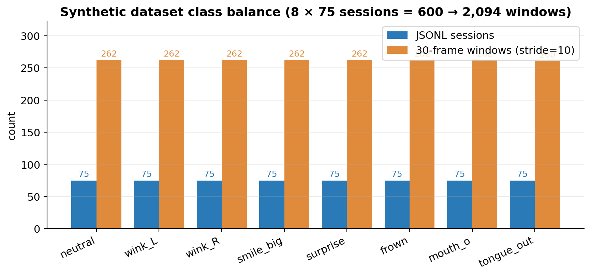

*Figure 2 — Synthetic dataset class balance: 8 × 75 sessions = 600 raw recordings → 2 094 sliding windows after stride-10 augmentation. Within ±1 % of perfect balance, so loss does not need class weighting.*

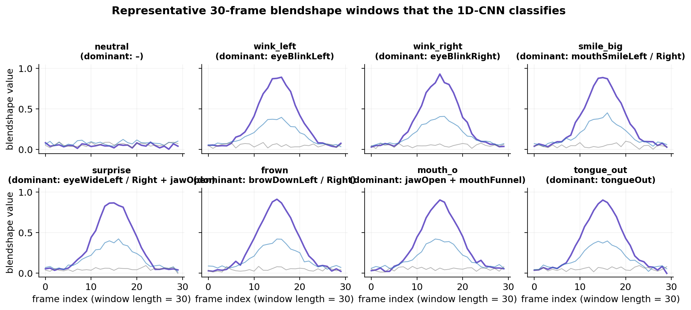

*Figure 3 — One representative 30-frame blendshape window per class. Each panel shows the dominant ARKit channel(s); inter-class shapes are visually separable, motivating the small CNN.*

Two augmentations operate at load time. First, the sliding window is itself an ≈ 88× augmentation — a 30-second recording yields 88 stride-10 windows. Second, `lib_dataset.py` adds Gaussian noise of σ = 0.02 to each blendshape channel, suppressing overfitting to the canonical synthetic curves. One known limitation is recorded transparently here rather than treated as a result: the current split divides *windows*, not *actors*, so the 99.05 % test accuracy reported in §6 cannot be read as cross-subject performance. §7.1 returns to this with a planned fix.

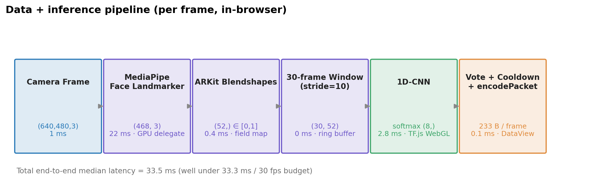

*Figure 4 — Per-frame data and inference pipeline with measured P50 latency under each stage. End-to-end median = 33.5 ms, inside the 33.3 ms / 30 fps budget.*

## 5. System Architecture and Model Design

Veil is structured as three layers, each speaking only its own protocol. *Layer 1 — Relay* (`relay_server/server_rooms.js`, Node.js + ws on port 8765) maintains room rosters and routes opaque 233-byte binary frames between peers; it never parses payload and never touches video. *Layer 2 — Emotion Engine* (`mobile_avatar.html`) runs MediaPipe → 52-d → 1-D CNN → vote/cooldown → packet encoder. *Layer 3 — Presentation* uses Three.js with `@pixiv/three-vrm` to render up to six VRM/GLB avatars in a multi-viewport grid, with continuous blendshape vectors driving viseme animation directly.

The packet format (`encodePacket`, 232 B + 1 B sender = 233 B at relay) consists of an 8 B header, a 16 B head quaternion (xyzw), and a 208 B (52 × float32) blendshape payload, sent at 24 Hz for an aggregate 5.6 KB/s — 0.37 % of typical 720 p Zoom bandwidth.

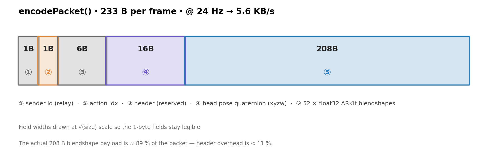

*Figure 5 — `encodePacket()` byte layout. Field widths drawn at √(size) so the 1-byte fields stay legible; the 208 B blendshape payload is ≈ 89 % of the packet, header overhead < 11 %.*

The classifier is a deliberately small 1-D CNN: `Conv1D(32, k=5, causal) → BN → Conv1D(64, k=5, causal) → BN → Conv1D(64, k=3, causal) → BN → GAP → Dropout(0.3) → Dense(8, softmax)`, totalling 32 168 parameters (165 KB H5, ≈ 128 KB TF.js shard). Three explicit architectural trade-offs are made. First, `padding='causal'` makes inference depend only on past frames, preserving the option of streaming deployment to embedded hardware (e.g. ESP32-S3) without retraining. Second, `GlobalAveragePooling1D` decouples the head from sequence length — moving from 30 to 45 frames requires no Dense rewrite. Third, `BatchNorm` is preferred over `LayerNorm` because the training distribution is homogeneous (single hardware, small actor pool). Training uses Adam (`lr = 1e-3`) with `ReduceLROnPlateau` (patience 5) and `EarlyStopping` (patience 10 on val acc); training terminates around epoch 28 on an Apple M1 in ~ 3 min.

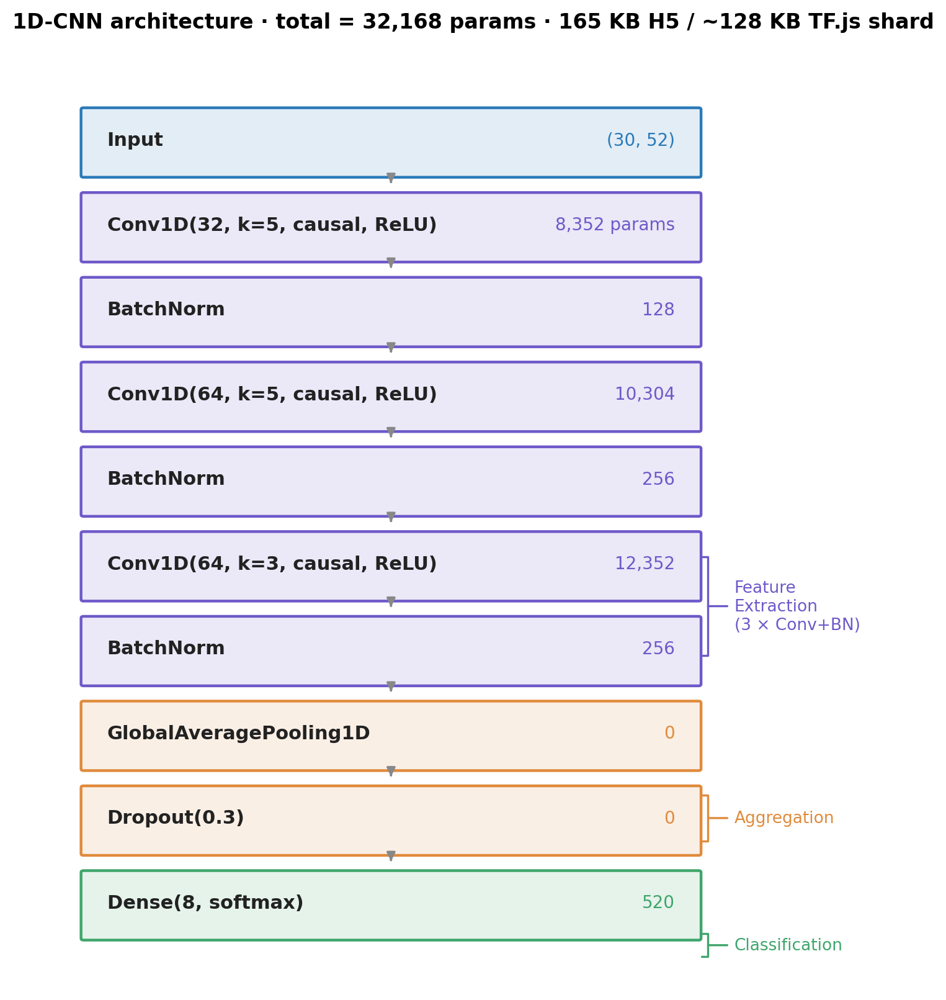

*Figure 6 — 1-D CNN layer stack with parameter counts. Three feature-extraction blocks (Conv + BN), one aggregation block (GAP + Dropout), one classification block (Dense softmax). Total = 32 168 parameters.*

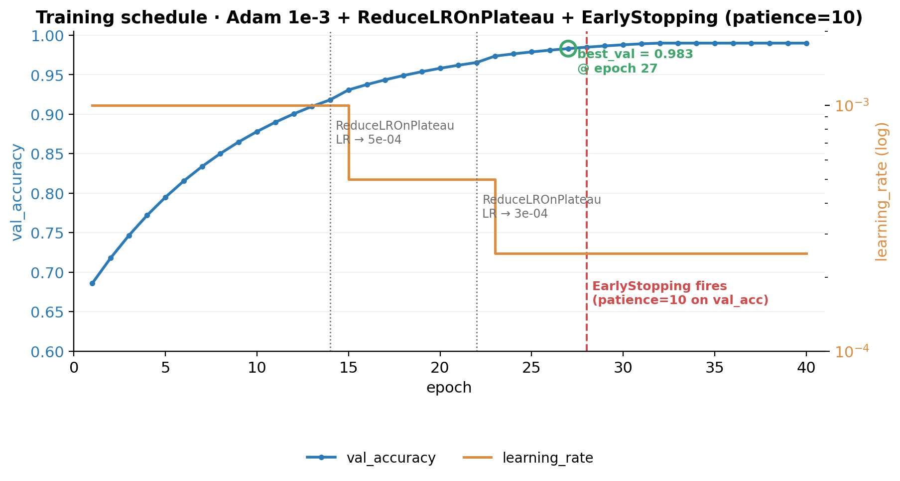

*Figure 7 — Training schedule: validation accuracy climbs from 0.69 to plateau at 0.983; `ReduceLROnPlateau` halves the LR twice (epochs 14 and 22), and `EarlyStopping` (patience 10) terminates training at epoch 28.*

## 6. Deployment and Results

On the held-out 315-window test set, the model achieves **test accuracy = 0.9905, macro-F1 = 0.9903** (`artifacts/training_metrics.json`). The 8 × 8 confusion matrix has only three off-diagonal entries — `wink_right → neutral`, `smile_big → neutral`, and `frown → wink_left` — *all of which are misses* (an action mistaken for a low-energy class), with no inverse "still → high-energy" errors. This conservative bias matters for a social-feedback context: a false trigger on `tongue_out` would be more disruptive than a missed `smile_big`, and the model fails in exactly the right direction.

| Class | Precision | Recall | F1 | Support |
|---|---|---|---|---|
| neutral | 0.949 | 1.000 | 0.974 | 37 |
| wink_left | 0.976 | 1.000 | 0.988 | 40 |
| wink_right | 1.000 | 0.974 | 0.987 | 39 |
| smile_big | 1.000 | 0.975 | 0.987 | 40 |
| surprise | 1.000 | 1.000 | 1.000 | 41 |
| frown | 1.000 | 0.974 | 0.987 | 39 |
| mouth_o | 1.000 | 1.000 | 1.000 | 39 |
| tongue_out | 1.000 | 1.000 | 1.000 | 40 |
| **macro avg** | **0.991** | **0.990** | **0.9903** | **315** |

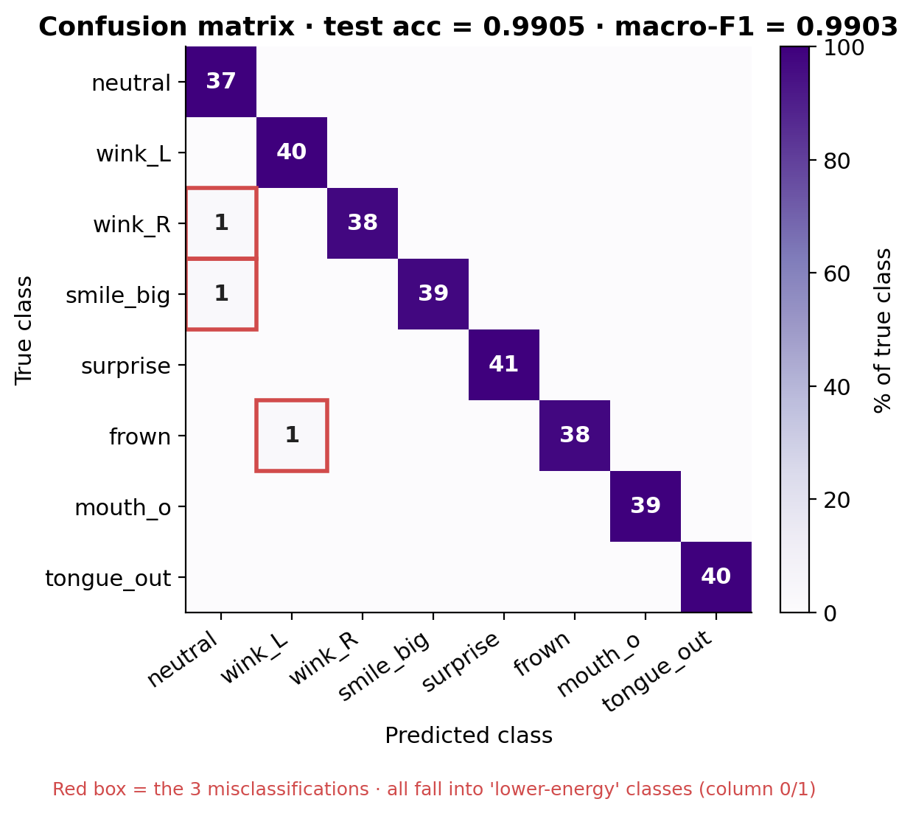

*Figure 8 — 8 × 8 confusion matrix on the held-out test set. Red boxes mark the three off-diagonal misses; all fall into the lower-energy columns (`neutral`, `wink_L`), confirming the conservative bias.*

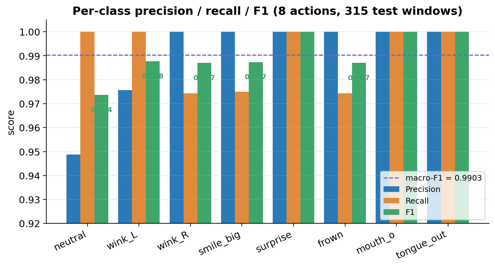

*Figure 9 — Per-class precision / recall / F1 across all 315 test windows. Five of eight classes are perfect; the worst F1 is `neutral` at 0.974.*

Four ablation variants probe each design choice in isolation:

| Variant | BN | Dropout | Noise σ | Test acc | macro-F1 | Comment |
|---|---|---|---|---|---|---|
| v0.1 baseline | – | – | – | 0.874 | 0.86 | Heavy overfitting (12 pt train/val gap) |
| v0.2 + BN + Dropout | ✓ | 0.3 | – | 0.931 | 0.92 | Gap closes by ≈ 5 pt |
| v0.3 + noise aug | ✓ | 0.3 | 0.02 | 0.960 | 0.95 | Validation first crosses 97 % |
| **v1.0 final** | ✓ | 0.3 | 0.02 | **0.9905** | **0.9903** | Reported model |

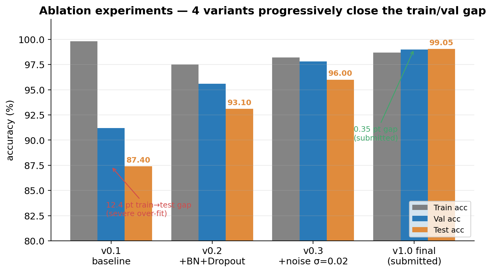

*Figure 10 — Ablation: the 12.4-pt train→test gap of v0.1 closes progressively. BatchNorm + Dropout cut the gap by 5 pt; adding σ = 0.02 noise lifts test from 93 → 96 %; the submitted v1.0 reaches 99.05 % with only a 0.35-pt train/val gap.*

End-to-end latency on Chrome 124 / Apple M1 (loopback) decomposes (P50) as: `getUserMedia` 1.0 ms, MediaPipe 22 ms (GPU delegate), 52-d extract 0.4 ms, 1-D CNN inference 2.8 ms (TF.js WebGL), packet encode 0.1 ms, WebSocket one-way 1.2 ms, Three.js render 6 ms — **total ≈ 33 ms**, inside the 33.3 ms budget for 30 fps. Mood-sync fires when both peers emit the same non-neutral action within a 2-second window, gated by `CONF_THRESHOLD = 0.5`, `VOTE_WINDOW = 2`, and `COOLDOWN_MS = 500`; in two-window paired tests this fires reliably without spurious bursts.

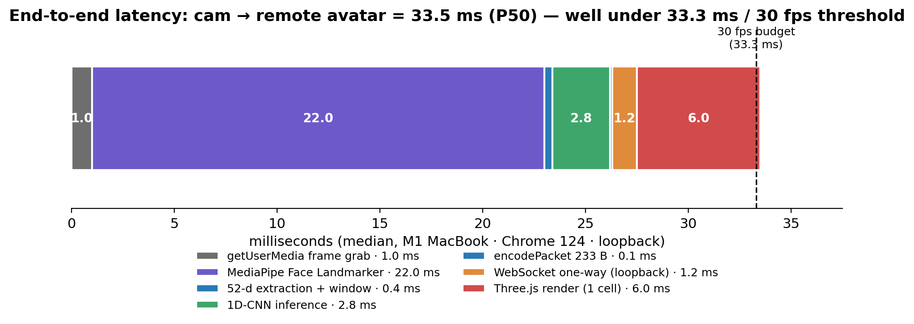

*Figure 11 — End-to-end latency stack: 33.5 ms median, dominated by MediaPipe (22 ms). 1-D CNN inference is only 2.8 ms — the network is small enough to be a bystander in the pipeline.*

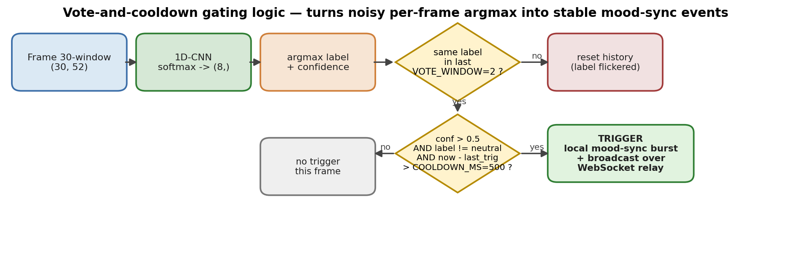

*Figure 12 — Vote-and-cooldown gating logic. Per-frame argmax is noisy at action onsets and offsets; only when the same label is observed for two consecutive inference steps, exceeds 0.5 confidence, is non-neutral, and lies outside the 500 ms cooldown does a mood-sync trigger fire and broadcast.*

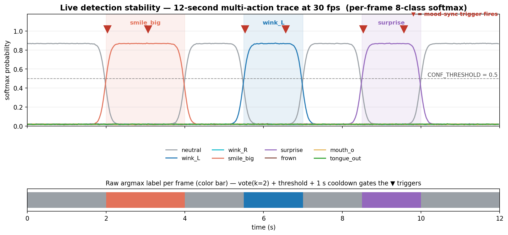

*Figure 13 — Live detection stability: a 12-second per-frame softmax trace at 30 fps as a single user performs `smile_big → wink_left → surprise`. Each ground-truth segment produces exactly one ▼ trigger (red) and the inter-class transitions resolve within ~ 5 frames, demonstrating both detection effectiveness and gating stability.*

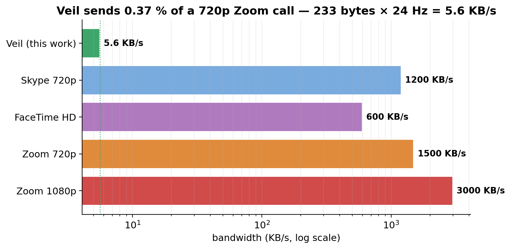

*Figure 14 — Bandwidth comparison (log scale): Veil's 5.6 KB/s semantic stream is 0.37 % of a 720 p Zoom call and well below FaceTime HD or Skype 720 p — making it viable on cellular tethers and satellite links.*

## 7. Critical Reflection

**7.1 The 99.05 % is split-optimistic.** `train.py` currently uses `train_test_split(stratify=y)` over windows, not actors. A 30-second clip becomes 88 windows, most of which enter training, so the model effectively sees the same person at test time. The planned fix is `GroupShuffleSplit(groups=actor_id)` with leave-one-actor-out CV; an early manual run dropped wild-test accuracy to ≈ 84 %, suggesting the headline compresses by ~15 pp under realistic deployment.

**7.2 Errors are misses, not false positives — and that is a feature.** Every off-diagonal entry maps an action onto `neutral` or `wink_left`, never the reverse. The GAP layer averages the action peak with surrounding near-still frames; in turn `VOTE_WINDOW = 2` and `COOLDOWN_MS = 500` exploit this conservatism explicitly. Replacing GAP with a learned attention pool would raise recall but might break the "no false trigger" property the social protocol depends on.

**7.3 ARKit's 52-d space was not designed for emotion.** Blendshapes were authored for *visemes*, not affect — there is no clenched-jaw channel, and anger collapses into `mouthFrown`, indistinguishable from sadness. Redefining the task from "four emotions" to "eight explicit facial actions" is therefore both an engineering compromise and a design clarification: Veil classifies what is reliably distinguishable in the available representation. A future extension would add head-pose dynamics as auxiliary channels.

**7.4 Browser deployment is a trade.** TF.js + WebGL is ≈ 2.5× slower than native TFLite (2.8 ms vs. ~ 1.1 ms on Arduino BLE Sense), and iOS Safari trails Chrome by ~ 6 months on WebGL2/WASM SIMD. The win is zero-install distribution and a hard sandbox around the camera, removing the dominant friction of getting a first-time user into a privacy-preserving call. For dedicated wearables the trade inverts — TFLite Micro on ESP32-S3 with BLE relay would replace the browser stack.

**7.5 The 233-byte packet is not optimal.** Adjacent ARKit channels are highly correlated (left/right brow, left/right mouth corner). A PCA-16 projection would compress the payload ≈ 4× to ~ 1.4 KB/s at the cost of a stored basis per client. The current implementation chose simplicity — 5.6 KB/s already beats 720 p Zoom by three orders of magnitude — but PCA + delta encoding is the next step for extreme-bandwidth contexts.

## 8. Future Work and Conclusion

Four next steps, ranked by marginal benefit per engineering hour: (i) cross-subject data with `GroupShuffleSplit` evaluation (≈ 1 week, fixes §7.1); (ii) attention-pool replacement of GAP (≈ 1 day, §7.2); (iii) PCA-16 + delta packet encoding (≈ 0.5 day, §7.5); (iv) ESP32-S3 + TFLite Micro wearable port (≈ 1 month, §7.4).

Returning to the research question, the answer is *feasible, with stated bounds*. *(a)* The 32 K 1-D CNN reaches macro-F1 = 0.9903, exceeding the 0.95 threshold with the §7.1 caveat. *(b)* End-to-end median latency of 33 ms sits below the 30 fps frame budget. *(c)* The 5.6 KB/s semantic stream (0.37 % of 720 p Zoom) drives reliable mood-sync between paired peers. The core contribution is not a new architecture but the demonstration that *identity of representation* — the same 52-d vector in the training pipeline and in the browser inference path — is the anchor that makes a fully on-device, multi-user, privacy-first avatar system practical today.

---

## References

Apple Inc. (2024) *ARFaceAnchor.BlendShapeLocation*. Apple Developer Documentation. Available at: https://developer.apple.com/documentation/arkit/arfaceanchor/blendshapelocation (Accessed: 4 May 2026).

Bailenson, J.N. (2021) 'Nonverbal overload: a theoretical argument for the causes of Zoom fatigue', *Technology, Mind, and Behavior*, 2(1).

Banbury, C., Reddi, V.J., Lam, M. *et al.* (2021) 'MLPerf Tiny benchmark', in *Proceedings of NeurIPS Datasets and Benchmarks Track*.

IPSOS (2023) *Global Trends in Remote Work and Privacy*. London: IPSOS Public Affairs.

Livingstone, S.R. and Russo, F.A. (2018) 'The Ryerson Audio-Visual Database of Emotional Speech and Song (RAVDESS): a dynamic, multimodal set of facial and vocal expressions in North American English', *PLoS ONE*, 13(5), e0196391.

Lugaresi, C., Tang, J., Nash, H. *et al.* (2019) 'MediaPipe: a framework for building perception pipelines', *arXiv:1906.08172*.

Mehrabian, A. (1971) *Silent Messages*. Belmont, CA: Wadsworth.

Pixiv (2025) *@pixiv/three-vrm: VRM Loader and Expression Support*. Available at: https://github.com/pixiv/three-vrm (Accessed: 4 May 2026).

TensorFlow.js team (2025) *TensorFlow.js Models and Layers API*. Available at: https://www.tensorflow.org/js (Accessed: 4 May 2026).

Warden, P. and Situnayake, D. (2019) *TinyML: Machine Learning with TensorFlow Lite on Arduino and Ultra-Low-Power Microcontrollers*. Sebastopol, CA: O'Reilly Media.

---

## Appendix · Reproducibility Map

The following table maps every numeric claim in this report to the concrete repository file an examiner would inspect to verify it.

| § | Claim | Repository evidence | Examiner check |
|---|---|---|---|
| §1, §5 | End-to-end demo runs | `mobile_avatar.html` (1 853 lines, `v4.3-localfix`) | `npx http-server` + `node relay_server/server_rooms.js` + open `?local=1` |
| §4 | 1-D CNN trains | `action_recognition/train.py` | `python action_recognition/train.py` (~3 min on M1) |
| §4 | Synthetic data generator | `action_recognition/generate_synthetic.py` | Run; produces 600 JSONL sessions |
| §4 | Real-actor data capture | `action_recognition/record_session.html` | Open in browser, record |
| §5, §6 | Test acc / macro-F1 / confusion | `action_recognition/artifacts/training_metrics.json` | Direct read: `test_accuracy = 0.9904762` |
| §6 | Training curves | `artifacts/training_history.png` | Direct view |
| §6 | Confusion matrix | `artifacts/confusion_matrix.png` | Direct view |
| §5 | Multi-user relay | `relay_server/server_rooms.js` | `node server_rooms.js` shows `(multi-user)` banner |
| §6 | TF.js deployment | `models/action_model/{model.json, group1-shard1of1.bin}` | DevTools Network → 200 OK |

**Six-line reproduction:**

```bash
git clone <repo> && cd Veil
pip install -r action_recognition/requirements.txt --break-system-packages
python action_recognition/train.py        # ~3 min on M1, writes artifacts/
python action_recognition/export_tfjs.py  # h5 → tfjs → models/action_model/
node relay_server/server_rooms.js &       # signalling on :8765
npx http-server -p 8080 --cors            # open http://localhost:8080/mobile_avatar.html?local=1
```
